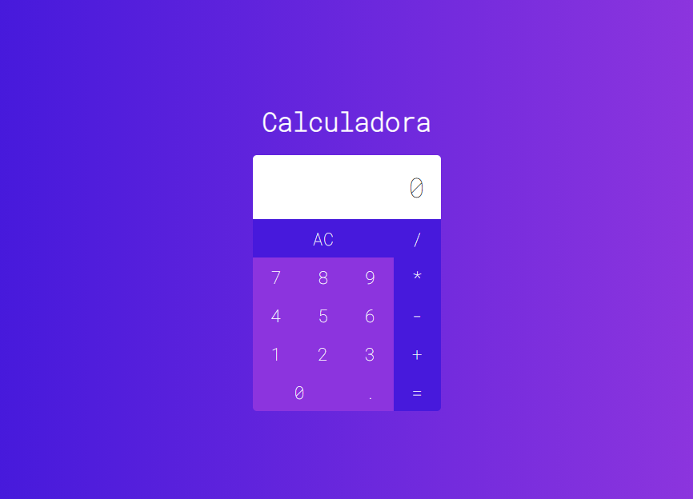

<h1 align="center">
    <b>Calculator</b> 
</h1>

  
  <a>
  

## :bookmark: Sobre

Calculadora com operações aritméticas básicas.

## :rocket: Tecnologias

O projeto foi desenvolvido utilizando as seguintes tecnologias:

-   [ReactJS](https://reactjs.org/)

## :heavy_check_mark: Inteface

<h1 align="center">
    
</h1>

## :recycle: Como contribuir

-   Faça um Fork desse repositório,
-   Crie uma branch com a sua feature: `git checkout -b my-feature`
-   Commit suas mudanças: `git commit -m 'feat: My new feature'`
-   Push a sua branch: `git push origin my-feature`
